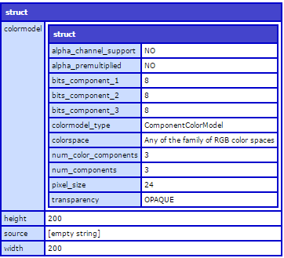

The following example shows how you can get an image’s information (width, height, alpha, etc) using the `<CFIMAGE>` tag in ColdFusion,

    <cfimage action="info" source="../images/BeBatman.jpg" structName="getImageInfo" />
    <cfdump var="#getImageInfo#" />

or by using the `imageInfo()` as

    <cfdump var="#ImageInfo(myImage)#">

Both of which should you image information in a nice `cfdump` format.

